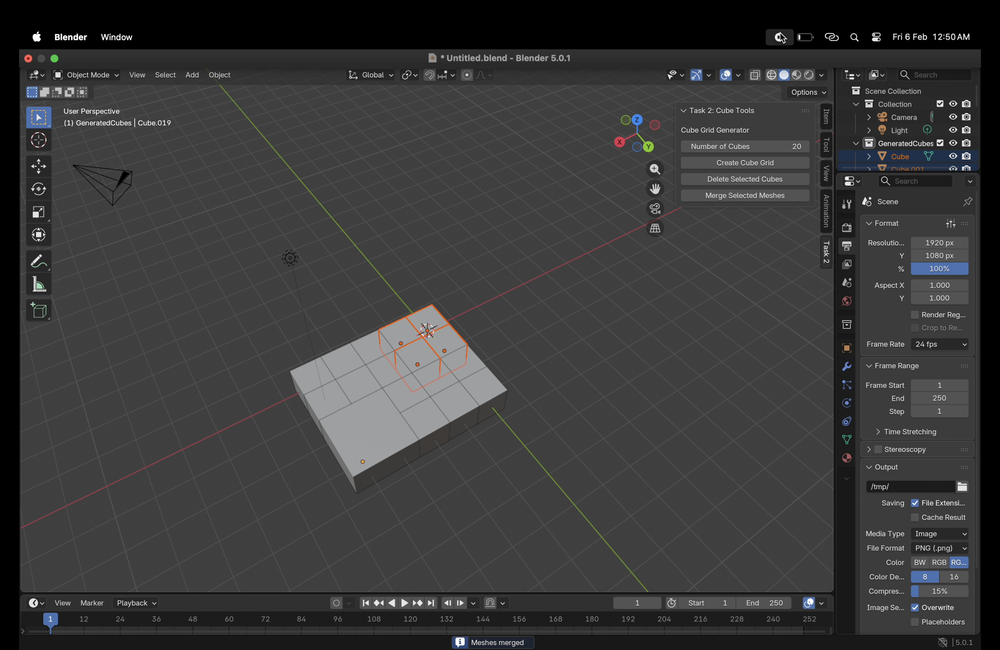

# Task 2 – Blender Addon: Cube Grid Generator

This task implements a Blender addon that provides tools to generate and
manage cube grids directly inside the 3D Viewport.

The addon is written in Python using Blender’s API and focuses on clean UI
design, safe scene manipulation, and clear separation of functionality.

---
## Demo

### Screenshot

### Video Walkthrough
🎥 [Watch the add-on in action](https://drive.google.com/file/d/1lmj2oyOLafK7gBhIoRLemnhfkA8rBdOz/view?usp=sharing)

## Feature Set 1 (Complete)

### UI Panel
- A custom panel is added to the 3D Viewport sidebar under the **Task 2** tab.
- The panel provides an input field `N` for the number of cubes to generate.

### Input Validation
- Only natural numbers are accepted.
- If `N > 20`, a warning popup is shown and no cubes are created.

### Cube Grid Generation
- Generates `N` cubes arranged in a 2D grid of size approximately `m × n`.
- Each cube has side length **1 Blender unit**.
- Cubes are placed on the **XY plane**.
- Spacing is slightly greater than 1 unit to avoid overlap.

### Scene Organization
- All generated cubes are placed in a dedicated collection named
  **GeneratedCubes**.
- Previously generated cubes in this collection are cleared before creating
  a new grid to prevent overlap.
- Existing scene objects (default cube, camera, light) are not modified.

### Deletion Tool
- A button is provided to delete **selected mesh objects only**.
- Non-mesh objects are ignored to ensure non-destructive behavior.

---

## Feature Set 2 (Attempted – Advanced)

### Merge Selected Meshes
- A button is provided to merge selected mesh objects into a single mesh.
- The merge operation uses Blender’s native `join` operator.

### Common-Face Condition (Approximation)
- Before merging, the addon attempts to detect whether selected meshes share
  at least one common face.
- This condition is approximated using **axis-aligned bounding box adjacency**
  in world space.

### Limitations and Design Choice
- Due to floating-point precision, transform state, and Blender operator
  behavior, exact face-level detection may be inconclusive.
- When a common face cannot be reliably detected, the addon warns the user and
  proceeds with the merge to preserve usability.
- Explicit face removal and vertex welding are delegated to Blender’s internal
  mesh handling for stability.

This approach prioritizes robustness and clarity over complex low-level mesh
manipulation.

---

## Usage Instructions

1. Open Blender.
2. Go to **Edit → Preferences → Add-ons → Install**.
3. Select `task2_blender_addon.py` and enable the addon.
4. In the 3D Viewport, press **N** to open the sidebar.
5. Open the **Task 2** tab to access the cube tools.
6. Use the buttons to generate, delete, or merge cubes.

---
## Testing

Manual testing was performed inside Blender:

- Generated cube grids with different values of N (<20).
- Verified grid layout, spacing, and non-overlapping placement.
- Confirmed generated cubes are placed in a dedicated collection.
- Tested deletion of selected cubes without affecting other objects.
- Tested merge operation with adjacent and non-adjacent cubes to verify behavior.

---

## Notes

- The addon avoids destructive operations on existing scene objects.
- Generated objects are clearly separated using a dedicated collection.
- The implementation is designed to be readable, stable, and easy to extend.
